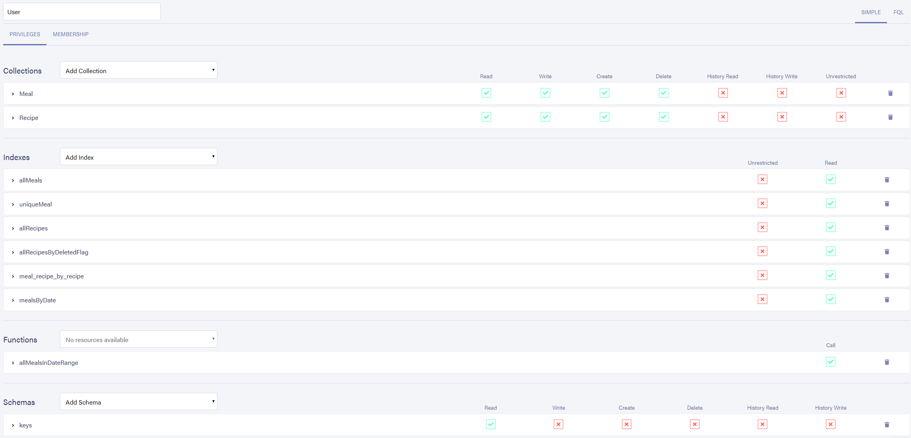

# FaunaDB Database setup

1. Create database
2. Import GraphQL Schema
3. Create Collection `Users`
4. Create Indexes:

```
CreateIndex({
  name: "uniqueMeal",
  unique: true,
  serialized: true,
  source: Collection("Meal"),
  terms: [
    {
      field: ["data", "date"]
    },
    {
      field: ["data", "type"]
    }
  ]
})
```

```
CreateIndex({
  name: "mealsByDate",
  source: Collection("Meal"),
  values: [{field: ["data", "date"]}, {field: ["ref"]}]
})
```

```
CreateIndex({
  name: "usersByEmail",
  source: Collection("Users"),
  terms: [{field: ["data", "email"]}],
  unique: true,
})
```

5. Define Function content

allMealsInDateRange

```
Query(
  Lambda(
    ["from", "to", "size", "after", "before"],
    Map(
      Paginate(Range(Match(Index("mealsByDate"), []), Var("from"), Var("to"))),
      Lambda(["d", "r"], Get(Var("r")))
    )
  )
)
```

6. Create application user

```
Create(
  Collection("Users"),
  {
    credentials: { password: "<password>" },
    data: {
      email: "<email>",
    },
  }
)
```

7. Create Users role with the following permissions:



8. Create Login Key for role `Server` and store the secret
